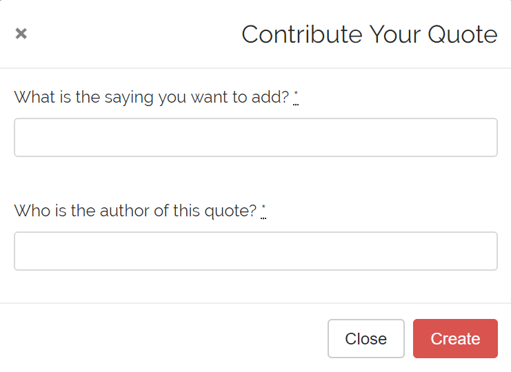
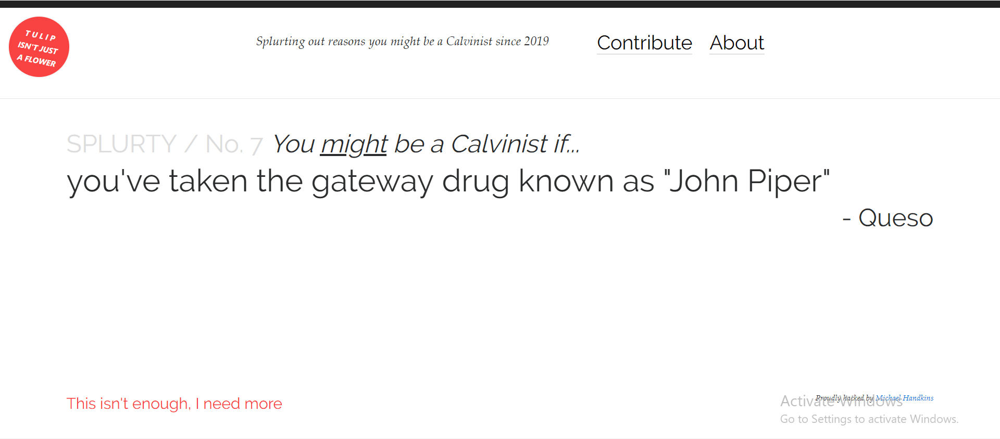

Splurty
=======

A database-powered quote generator with a mobile-first design, using the Ruby on Rails framework, HTML, and CSS. Uses Git and GitHub for version control, and launched on Heroku. Specifically, this version of Splurty is for adding reasons that one may be a Calvinist.

Technologies Used
-----------------

  * Ruby, v. 2.5.3 (primary programming language)
  * HTML5/CSS3 (basic structure & design)
  * Rails (framework)
  * Postgres (relational database)
  * Bootstrap (design elements)

Interface
---------

Any user who visits Splurty may add a reason that one might be a Calvinist to the database.

The reasons are then randomly displayed one at a time on the home page. A random quote is selected each time the home page is refreshed.

Splurty is deployed at https://splurty-handkins.herokuapp.com/
